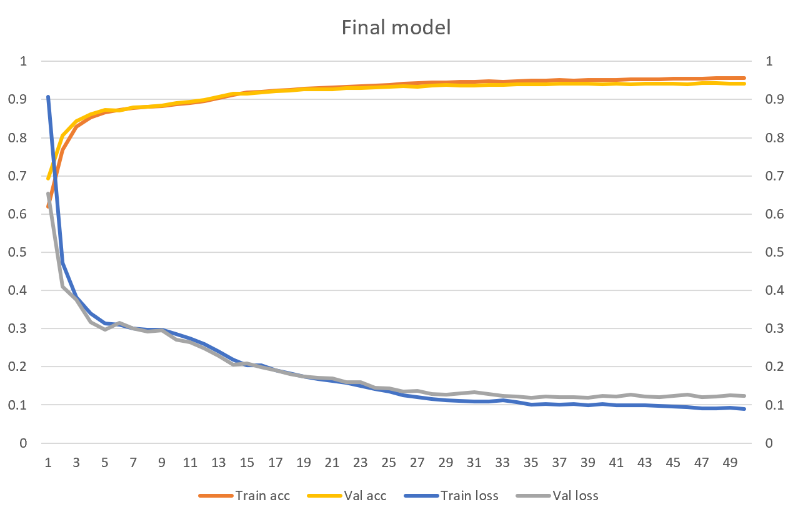

This is a Transformed based solution to restore Vietnamese diacritics from diacritics-less text. I also took inspiration from how machine translation works. Transformer related code is adopted from Chapter 11 of the book *Deep Learning with Python by Francois Chollot*, which can be found [here](https://github.com/fchollet/deep-learning-with-python-notebooks/blob/master/chapter11_part04_sequence-to-sequence-learning.ipynb).

You can download the trained model and its vetorization files from [this](https://drive.google.com/drive/folders/1duBcp3YTsKeYz8xQThBsDjEUx3zRoLS3) link.

You don't need to understand Vietnamese to use this repository, so please take a look. For more information, please see my blog at the link below.

[https://duongnt.com/restore-vietnamese-diacritics](https://duongnt.com/restore-vietnamese-diacritics)

## Usage

### Prepare the training dataset

Please download and extract [this](https://www.kaggle.com/alvations/old-newspapers) dataset from Kaggle. After that, run the following command to extract Vietnamese sentences and create their diacritics-less version.
```
dotnet run <path to input file> <path to output file>
```

### Train the model

Load data from the `txt` file and perform preprocessing.
```
from data_loader import load_data, load_data, save_vectorization, make_dataset

file_path = 'dataset/old-newspaper-vietnamese.txt'
train_pairs, val_pairs, test_pairs = load_data(file_path, limit=10000)

source_vectorization, target_vectorization = create_vectorizations(train_pairs)
save_vectorization(source_vectorization, 'result/source_vectorization_layer.pkl')
save_vectorization(target_vectorization, 'result/target_vectorization_layer.pkl')

batch_size = 64
train_ds = make_dataset(train_pairs, source_vectorization, target_vectorization, batch_size)
val_ds = make_dataset(val_pairs, source_vectorization, target_vectorization, batch_size)
test_ds = make_dataset(test_pairs, source_vectorization, target_vectorization, batch_size)
```

Create a `TransformerModel` object and begin training.
```
from transformer_model import TransformerModel

transformer = TransformerModel(source_vectorization=source_vectorization,
    target_vectorization=target_vectorization,
    dense_dim=8192, num_heads=8, drop_out=0)

transformer.build_model(optimizer="rmsprop",
    loss="sparse_categorical_crossentropy",
    metrics=["accuracy"])
transformer.fit(train_ds, epochs=50, validation_data=val_ds,
    callbacks=[
        tf.keras.callbacks.ModelCheckpoint(
            filepath='result/restore_diacritic.keras',
            save_best_only='True',
            monitor='val_accuracy'
        )
    ])
```

You can pass arguments to the constructor of `TransformerModel` to change its architecture.
- *sequence_length*: the maximum number of words in a sentence that we will process.
- *vocab_size*: this is to limit the size of our vocabulary.
- *embed_dim*: the number of dimensions in the embed layer of Transformer.
- *dense_dim*: the number of dimensions in the dense layer of Transformer.
- *num_heads*: the number of attention heads in Transformer.
- *drop_out*: the dropout rate.

After 50 epochs, our the model achieved `94.26%` accuracy on the validation set and `94.05%` accuracy on the test set.

<p align="center">
    
</p>

### Use a trained model to make inferences

To make inferences, we need both the model and the saved vectorization files.
```
transformer = TransformerModel(source_vectorization='result/source_vectorization_layer_cont.pkl',
    target_vectorization='result/target_vectorization_layer_cont.pkl',
    model_path='result/restore_diacritic.keras')
    
print(transformer.predict('co phai em la mua thu ha noi'))
print(transformer.predict('em con nho hay em da quen'))
print(transformer.predict('ha noi mua nay vang nhung con mua'))
print(transformer.predict('dat nuoc toi thon tha giot dan bau'))
```

The code above should print the following to console.
```
có phải em là mùa thu hà nội
em còn nhớ hay em đã quên
hà nội mùa này vắng những cơn mưa
đất nước tôi thon thả giọt đàn bầu
```

### Resume training from a checkpoint

We can continue training from a model and its corresponding vectorization files.
```
from data_loader import load_vectorization_from_disk

source_vectorization = load_vectorization_from_disk('result/source_vectorization_layer_cont.pkl')
target_vectorization = load_vectorization_from_disk('result/target_vectorization_layer_cont.pkl')

train_ds = make_dataset(train_pairs, source_vectorization, target_vectorization, batch_size)
val_ds = make_dataset(val_pairs, source_vectorization, target_vectorization, batch_size)

transformer = TransformerModel(source_vectorization=source_vectorization,
    target_vectorization=target_vectorization,
    model_path='result/restore_diacritic_cont.keras')
transformer.fit(train_ds, epochs=50, validation_data=val_ds,
    callbacks=[
        tf.keras.callbacks.ModelCheckpoint(
            filepath='result/restore_diacritic.keras',
            save_best_only='True',
            monitor='val_accuracy'
        )
    ])
```

## License

MIT License

https://opensource.org/licenses/MIT
